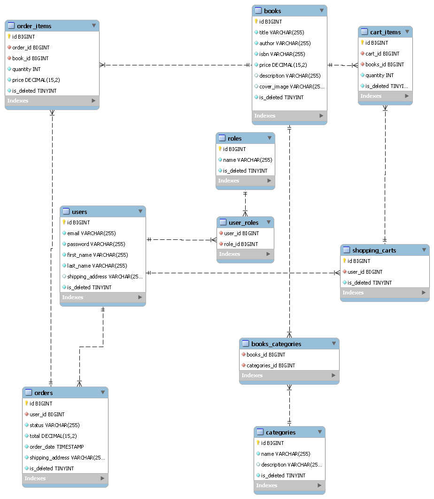

# Online Book Store API

The **JV Online Book Store API** is a comprehensive backend application that provides an API for managing books, categories, orders, and shopping carts. This project was created to simplify the management of a large number of books in an online store by offering an easy-to-use set of API interfaces. The application supports CRUD (Create, Read, Update, Delete) operations and allows searching for books based on defined criteria.

## Technologies and Tools

This project utilizes a range of advanced technologies and tools to create a secure, efficient, and scalable API:

- **Spring Boot 3.3.1** - Enables rapid development of Java applications with minimal configuration.
- **Spring Security 6.3.1** - Ensures secure access to the API through authorization and authentication.
- **Spring Data JPA** - Simplifies data management using Java Persistence API.
- **Swagger (Springdoc OpenAPI)** - Automatically generates API documentation.
- **MapStruct** - Facilitates the mapping of DTO objects within the application.
- **JWT (JSON Web Token)** - Implements JWT tokens for secure authentication.
- **Liquibase** - Manages database migrations and schema versioning.
- **Hibernate Validator** - Validates input data.
- **Testcontainers** - Creates isolated testing environments using Docker containers.
- **H2 Database** - Used for testing purposes.
- **MySQL** - Used as the database in the production environment.
- **Lombok** - Reduces boilerplate code by automatically generating getter, setter, and other methods.
- **Checkstyle** - Ensures code compliance with coding standards.

## Features

The controllers in this application are designed with usability and security in mind:

- **AuthenticationController** - Manages user registration and login.
- **BookController** - Provides full CRUD operations on books and allows searching based on various criteria.
- **CategoryController** - Enables the creation, editing, deletion, and viewing of book categories, as well as viewing books assigned to specific categories.
- **OrderController** - Manages the order placement process and order history viewing.
- **ShoppingCartController** - Allows users to manage their shopping cart, including adding, editing, and removing items.

# API Controllers Documentation

## Authentication Controller

- **POST** `/auth/registration` - Register a new user.
- **POST** `/auth/login` - Authenticate user and get JWT tokens.

## Book Controller

- **GET** `/books` - Get a list of all available books.
- **GET** `/books/{id}` - Get details of a book by its ID.
- **POST** `/books` - Create a new book.
- **PUT** `/books/{id}` - Update details of a book by its ID.
- **GET** `/books/search` - Search books by parameters (title, author, ISBN).
- **DELETE** `/books/{id}` - Delete a book by its ID.

## Category Controller

- **POST** `/category` - Create a new category.
- **GET** `/category` - Get a list of all available categories.
- **GET** `/category/{id}` - Get details of a category by its ID.
- **PUT** `/category/{id}` - Update details of a category by its ID.
- **DELETE** `/category/{id}` - Delete a category by its ID.
- **GET** `/category/{id}/books` - Get all books associated with a category ID.

## Order Controller

- **POST** `/orders` - Place a new order.
- **GET** `/orders` - Get order history for the authenticated user.
- **GET** `/orders/{orderId}/items` - Get all items from a specific order.
- **GET** `/orders/{orderId}/items/{id}` - Get a specific item from an order.
- **PUT** `/orders/{id}` - Update the status of an order.

## Shopping Cart Controller

- **GET** `/cart` - Get the user's shopping cart.
- **POST** `/cart` - Add a new item to the user's cart.
- **PUT** `/cart/cart-items/{id}` - Update an item in the user's cart.
- **DELETE** `/cart/cart-items/{id}` - Remove an item from the user's cart.

## Visualization

## Configuration Instructions

#### Prerequisites

- Java 17
- Docker

#### Setup Steps

1. Check if you have Git installed: git --version
2. Clone the repository (You can use SSH): git clone git clone git@github.com:...
3. Alternatively, if you prefer to use HTTPS, the command would be: git clone https://...
4. Navigate into the cloned repository: cd jv-Online-Book-App-API
5. (Optional) Check the repository status: git status

### Build the project:
./mvnw clean package

### Start the project:
**Start Docker**: Make sure Docker is up and running before you proceed with the setup.

### After starting the application, the API documentation will be available at:
http://localhost:8080/swagger-ui.html

If you are inspired by the project, you can find more information in the code

## Application Information

- **Developer**: Marek Gucma